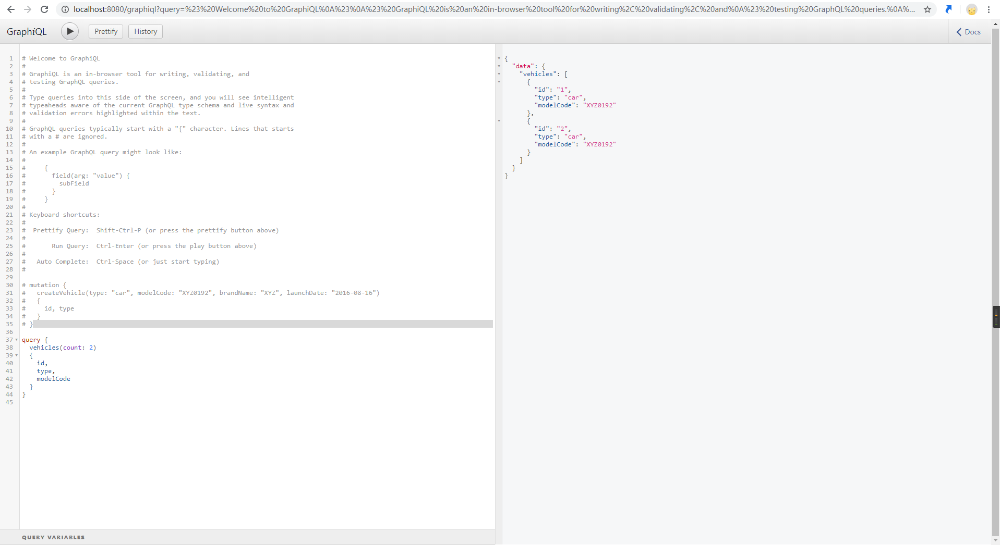

# GrapgQL

##
GraphQL demo

### 内容
这里的代码只是一个使用Spring Boot 组件搭建的GraphQL 服务器的一个小模型，关于更详细的内容，稍后更新。

### 依赖
```XML
	<dependencies>
        <!--Start-->
        <dependency>
            <groupId>org.springframework.boot</groupId>
            <artifactId>spring-boot-starter-web</artifactId>
        </dependency>

        <!--Test-->
        <dependency>
            <groupId>org.springframework.boot</groupId>
            <artifactId>spring-boot-starter-test</artifactId>
            <scope>test</scope>
        </dependency>

        <!--GraphQL-->
        <dependency>
            <groupId>com.graphql-java</groupId>
            <artifactId>graphql-java</artifactId>
            <version>9.0</version>
        </dependency>
    </dependencies>
```

### Main 类：
```Java
import graphql.ExecutionResult;
import graphql.GraphQL;
import graphql.schema.DataFetcher;
import graphql.schema.GraphQLSchema;
import graphql.schema.StaticDataFetcher;
import graphql.schema.idl.RuntimeWiring;
import graphql.schema.idl.SchemaGenerator;
import graphql.schema.idl.SchemaParser;
import graphql.schema.idl.TypeDefinitionRegistry;
import javafx.scene.input.DataFormat;
import org.slf4j.Logger;
import org.slf4j.LoggerFactory;

import static graphql.schema.idl.RuntimeWiring.newRuntimeWiring;

/**
 * @time: 2019/1/12
 * @author: Vgbh
 */
public class HelloWorld {

    private static final Logger log = LoggerFactory.getLogger(HelloWorld.class);

    public static void main(String[] args) {
        //请求信息
        String schema = "type Query{hello: String}";

        //模式解析器
        SchemaParser schemaParser = new SchemaParser();
        TypeDefinitionRegistry typeDefinitionRegistry = schemaParser.parse(schema);

        //运行时写入数据
        //newRuntimeWriting()为静态方法，返回Builder静态内部类
        RuntimeWiring runtimeWiring = newRuntimeWiring()
                .type("Query", builder -> builder.dataFetcher("hello", new StaticDataFetcher("world")))
                .build();

        //模式构造器
        SchemaGenerator schemaGenerator = new SchemaGenerator();
        GraphQLSchema graphQLSchema = schemaGenerator.makeExecutableSchema(typeDefinitionRegistry, runtimeWiring);

        //产生GraphQL，执行请求
        GraphQL build = GraphQL.newGraphQL(graphQLSchema).build();
        ExecutionResult executionResult = build.execute("{hello}");

        //输出结果
        log.info(executionResult.getData().toString());
        //{hello=world}
    }

}
```

<hr>

## GraphQL demo 3

### 内容
使用Spring Boot 、GraphQL 、 hibernate 来构建的一个Demo 样例。

### pom依赖

```xml
 <!--GraphQL Starter-->
        <dependency>
            <groupId>com.graphql-java</groupId>
            <artifactId>graphql-spring-boot-starter</artifactId>
            <version>5.0.2</version>
        </dependency>
        <dependency>
            <groupId>com.graphql-java</groupId>
            <artifactId>graphiql-spring-boot-starter</artifactId>
            <version>5.0.2</version>
        </dependency>

        <dependency>
            <groupId>org.springframework.boot</groupId>
            <artifactId>spring-boot-starter-web</artifactId>
        </dependency>

        <!--database-->
        <dependency>
            <groupId>com.h2database</groupId>
            <artifactId>h2</artifactId>
            <scope>runtime</scope>
        </dependency>
        <dependency>
            <groupId>org.springframework.boot</groupId>
            <artifactId>spring-boot-starter-data-jpa</artifactId>
        </dependency>

        <!--GraphQL Tools-->
        <dependency>
            <groupId>com.graphql-java</groupId>
            <artifactId>graphql-java-tools</artifactId>
            <version>5.2.4</version>
        </dependency>

        <!--lombok-->
        <dependency>
            <groupId>org.projectlombok</groupId>
            <artifactId>lombok</artifactId>
            <optional>true</optional>
        </dependency>
```

## 主要架构
Http Request -> Mutation(Insert)、Query(Select) -> Servise -> Repository -> Entity、graphqls

## 测试
http://localhost:8080/graphiql


<hr>

## 个人博客
我的博客有全部的关于GraphQL 的[讲解教程](https://vgbhfive.github.io/GraphQL-%E5%BF%AB%E9%80%9F%E5%85%A5%E9%97%A8/)，有兴趣的可以去看看。